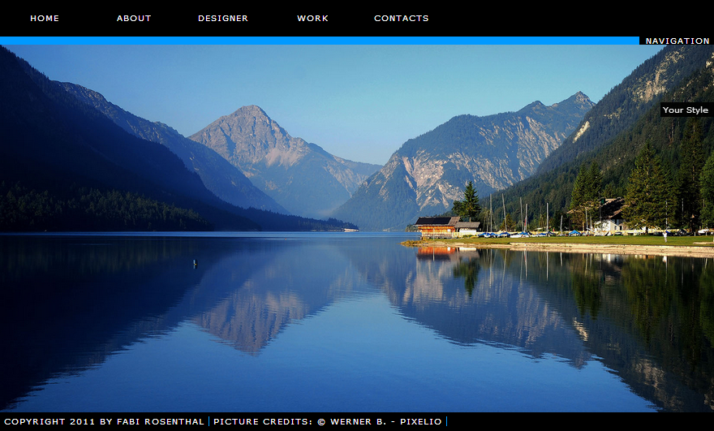
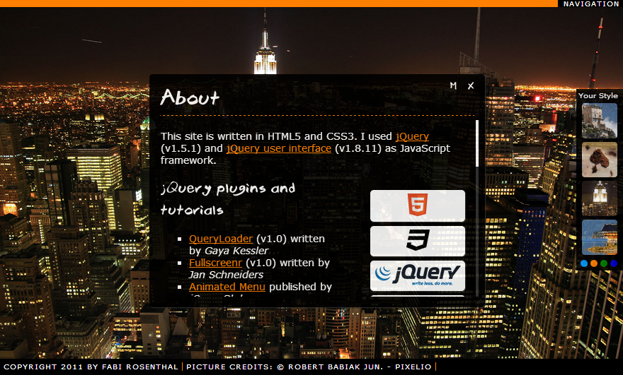

# Web design xennis_c4e

Modern web design with CSS3, HTML5 and jQuery.

Current version: 1.01

### Used software and files

JavaScript libaries

* [jQuery](http://jquery.com) (v.1.5)
* [jQuery UI](http://jqueryui.com) (v.1.8)
* [Typeface.js](http://typeface.neocracy.org) (v.0.15)

jQuery plugins and tutorials

* [QueryLoader](http://www.gayadesign.com/diy/queryloader-preload-your-website-in-style/) (v.1.0) by Gaya Kessler
* [Fullscreenr](http://nanotux.com/blog/fullscreen/) (v.1.0) by Jan Schneiders
* [Animated Menu](http://jqueryglobe.com/article/animated-menu) by jQueryGlobe
* [jScrollPane](http://jscrollpane.kelvinluck.com) (v.2.0.0.beta9) by Kelvin Luck
* [Mousewheel](http://brandonaaron.net/code/mousewheel/docs) (v.3.0.4) by Brandon Aaron
* [AnythingZoomer](http://css-tricks.com/anythingzoomer-jquery-plugin/) (v.1.0) by Chris Coyier

Images from [Pixelio](http://www.pixelio.de)

* [Dreckschleuder](http://www.pixelio.de/details.php?image_id=291716) by www.mx-harz.de
* [Der Plansee (Tirol)](http://www.pixelio.de/details.php?image_id=302266) by Werner B.
* [New York](http://www.pixelio.de/details.php?image_id=318894) by Robert Babiak jun.
* [Seekajaker](http://www.pixelio.de/details.php?image_id=22367) by Dietmar Meinert

Font

* Brook 23 (v2.0) by Mgl23

### Demo and screenshots

**Demo**: http://xennis.github.io/xennis_c4e/

